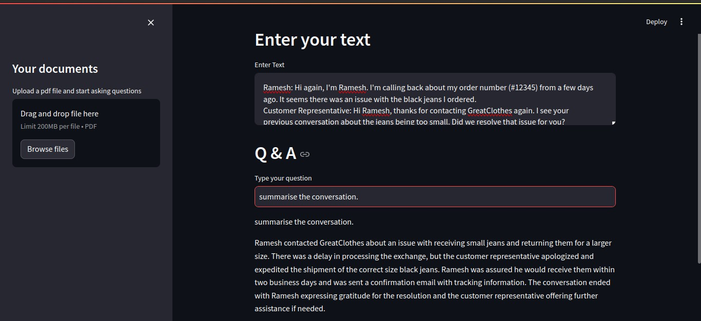
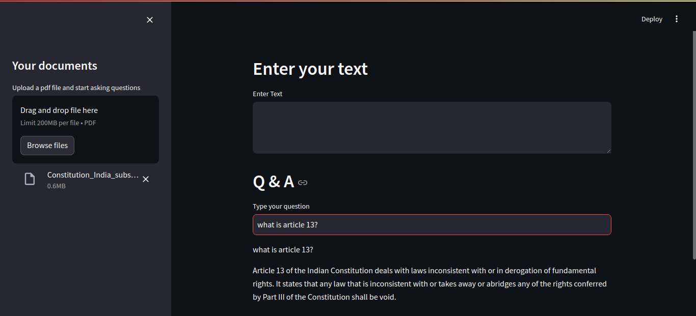

# AI-powered Q&A 

A python application that uses ChatGPT and langchain to respond to your questions/prompts on an uploaded pdf or text input.

## Requirements
1. OpenAI API Key (paid)
2. Required Packages:  

    - streamlit: A Python library for creating interactive web applications.
    - PyPDF2: A library for working with PDF files in Python.
    - langchain: A library for building question-answering systems.
    - langchain_openai: An extension for langchain that integrates OpenAI's API.
    - langchain_community.vectorstores: A subpackage within langchain that provides tools for vector stores.
    - openai: The official OpenAI API client library (may be included with langchain_openai).

## How to run
1. clone the repo.
````
git clone https://github.com/akhilVogeti/PDFInsights.git
````
2. Move to the root directory
````
cd PDFInsights
````
3. Install the dependencies 
````
pip install streamlit PyPDF2 langchain langchain_openai langchain_community
````
Any missing dependencies will be mentioned in the error message. Do install them using pip install command.
4. Run the code
````
streamlit run chatbot.py
````
5. Browser automatically opens. After a pdf is uploaded or input text is given or both, you can ask questions in the Q&A section. Until a pdf is uploaded or input text given, the Q&A box wont appear. 

## Output 
Here are some screenshots of the output


Screenshot showing convo summerisation.


Screenshot showing that AI doesnt know the info from the pdf alone.


It now answers the question based on pdf + text input.


Answers questions based on pdf content alone.

## How this works
Once running, the app takes either the text input or the pdf or both to generate text. The text is then divided into
chunks. Embeddings are then computed for those chunks and stored in a vector store. Here it is FAISS. 
  
FAISS (Facebook AI Similarity Search) is a library developed by Facebook AI Research that is designed for efficient similarity search and clustering of dense vectors. It is particularly useful in applications involving large datasets of high-dimensional vectors, such as those generated in machine learning and natural language processing tasks.

When a user asks a question, the application uses FAISS to find text chunks that are most similar to the query. This is done through the similarity_search method.

The llm here is gpt-3.5-turbo.

A load_qa_chain(from langchain) is then created using the llm, and chain_type = stuff. The stuff documents chain ("stuff" as in "to stuff" or "to fill") is the most straightforward of the document chains. It takes a list of documents, inserts them all into a prompt and passes that prompt to an LLM.
This chain is well-suited for Q&A on documents that are small and only a few are passed in for most calls.

The chain.run takes the matches from similarity search and user question as inputs and generates the response.